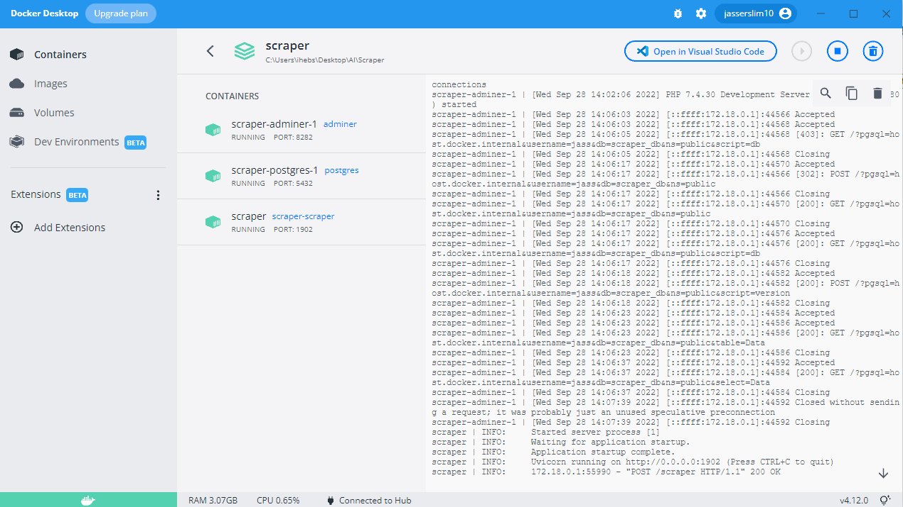

<h1 align="center">facebook_scraper</h1>
<p>
  
</p>

> In this repository I used facebook scrapper to get posts from public pages then store it in a postgres database. 

## Get started
I used docker compose for this purpose.
You can try that by typing this in your terminal.
Of course you need to have docker installed in your machine in order to run this.
```sh
docker-compose -f compose.yml up -d
```
(./images/images.PNG)

## Usage
In order to interact with the api I used postman to send requests 
Request body:
```sh
{
  "page_name": name of the scrapped facebook page.
  "number_pages": number of pages to scrape.

}
```


## Run tests
I created two unit tests: one to assert that the request is successful and the other to verify the communication with the database and types of returned data.
```sh
pytest
```


## choice of DataBase
I used postgres for this purpose.

## visualisation of database
You can find the schema of the database in database.sql

